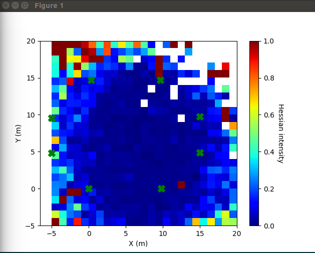

# MultilaterationTDOA

> Due to the lack of hardware available to me, this project cannot be maintained. Regardless, this was never meant to be used as is but just a way to understand rTDoA. (Passive tags, active anchors) 

This library will be used for TDoA localization from a [Bitcraze loco positioning system](https://www.bitcraze.io/loco-pos-system/). This is a side project which is imperfect and there is no warranty of success for your application.

**If you feel that something is wrong, please share it.**

This library fits your use-case if:

* **Setup**:
    * Multiple fixd anchors doing TWR between them
    * Tags receiving data from the anchors and computing the Time Difference on Arrival of messages between the messages of Anchors
* **Measurements**:
    * Position anchor 1 (m)
    * Position anchor 2 (m)
    * TDoA (m, you can take the time divided by the speed of light for the conversion)
    * With P = receiver position
    * With A = Anchor A position
    * With B = Anchor B position
    * TDoA = |PB| - |PA|

If you want information about the jacobians for fusing with a Kalman filter or using it in your optimization problem, you can look into [Algorithmics.md](Algorithmics.md).

In the case you are using time synchronised anchors which are only receiving, [this paper](http://files.andersen.im/analytics/Convex%20Optimization%20-%20Comparative%20Analysis%20of%20Multilateration%20Methods%20for%20Signal%20Emitter%20Positioning.pdf) describes a method allowing to reduce the problem to a linear system (3D with 5 anchors).

## Usage with Bitcraze Roadrunner and Loco positionning nodes

Install this library:

```bash
sudo python setup.py install
```

Then, follow the instructions available in the [MAVLink layer README.md](https://github.com/umdlife/roadrunner_mavlink)

## Minimal example

```python
#!/usr/bin/env python
# -*- coding: utf-8 -*-

from __future__ import division, print_function
from multilateration_tdoa import TDoAEngine, TDoAMeasurement, Anchor, Point
import numpy as np

NOISE = 0.25
MEAN_NOISE = 0.0

def noise():
    """Returns gaussian noise"""
    return np.random.normal(MEAN_NOISE, NOISE)

def tdoa(A,B,P):
    """Computes |PB| - |PA| + gaussian noise"""
    return P.dist(B)-P.dist(A) + noise()

def fakeTDOA(A,B,P):
    """Returns a fake measurements with anchors A, B from a point P"""
    return TDoAMeasurement(A, B, tdoa(A,B,P))

engine = TDoAEngine(n_measurements=6, max_dist_hess=100) # Avoid value rejection.

# Real world anchor positions
A = Anchor((3,3,0))
B = Anchor((-2,2,0))
C = Anchor((2,-4,0))
D = Anchor((-3,-2,0))
P = Point(0,0,0)

# Faking measurements
engine.add(fakeTDOA(A, C, P))
engine.add(fakeTDOA(A, B, P))
engine.add(fakeTDOA(A, D, P))
engine.add(fakeTDOA(B, C, P))
engine.add(fakeTDOA(B, D, P))
engine.add(fakeTDOA(C, D, P))

print("\n\nSolve in 3D from anchors on the ground and tag on the ground")
result, hess_inv = engine.solve()
print("result", result)
print("expected", P)
print("real error:", P.dist(result))
```

## Basic testing

To test the system, you can configure and run `python test.py` to locate from simulated data.

## Anchor placement testing

You can configure then run `python anchor_position_test.py` to generate a heatmap of localization quality.



## Caveats

- There is a discontinuity in the jacobians if the tag position or the optimization path is going close to one of the anchors, highlighted in the [issue #1](https://github.com/AlexisTM/MultilaterationTDOA/issues/1)
- Outlier rejection is weak and can be improved: if measures highly differ from the last [valid] result, the measurement is rejected. 
- The optimization problem is taking all the measuremnts as a whole and there is therefore no weighing of the measurements: Depending on the location of the tag, the error for the measurements can lead to very high errors; Meaning that a single measurement could lead to divergence. 
- The results are very noisy and I advise to filter it in a Kalman filter. Ideally having the output of the Kalman filter as the last result of the optimization problem for faster convergence.

## Author

- Alexis PAQUES (@AlexisTM)
